# Retail Customer Behavior Analysis

## Project Overview

This project analyzes retail customer shopping behavior using Python, MySQL, and Power BI. The goal is to clean and transform customer transaction data, store it in a relational database, answer business questions using SQL, and build an interactive dashboard to generate actionable insights.

---

## Business Objective

Retail businesses collect large amounts of customer purchase data. This project aims to:

- Understand customer purchasing patterns
- Analyze revenue contribution across categories
- Compare subscriber and non-subscriber behavior
- Identify high-performing product categories
- Explore customer demographics and spending habits
- Build an interactive dashboard for decision-making

---

## Tech Stack

### Python
- Pandas
- NumPy

### Database
- MySQL
- SQLAlchemy
- PyMySQL

### Data Visualization
- Power BI

### Version Control
- Git
- GitHub

---

## Project Workflow

### 1. Data Inspection

Performed initial exploration of the dataset.

- Checked dataset dimensions
- Examined data types
- Generated descriptive statistics
- Identified missing values

Screenshot:

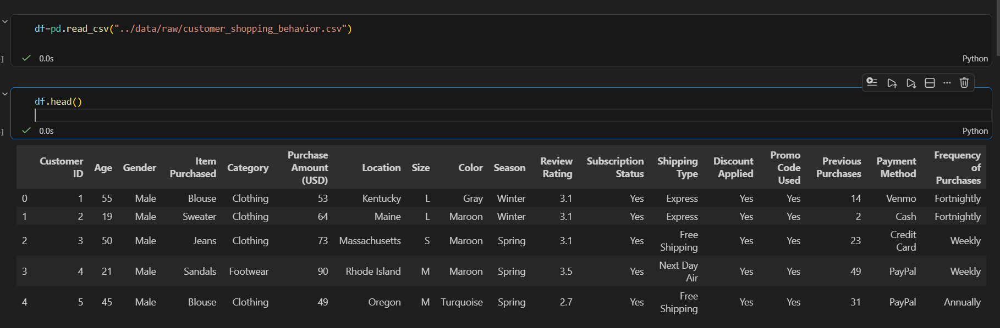

---

### 2. Data Cleaning

Handled missing values and improved data quality.

#### Missing Values Before Cleaning

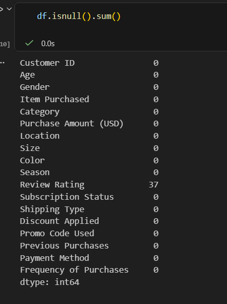

#### Missing Values After Cleaning

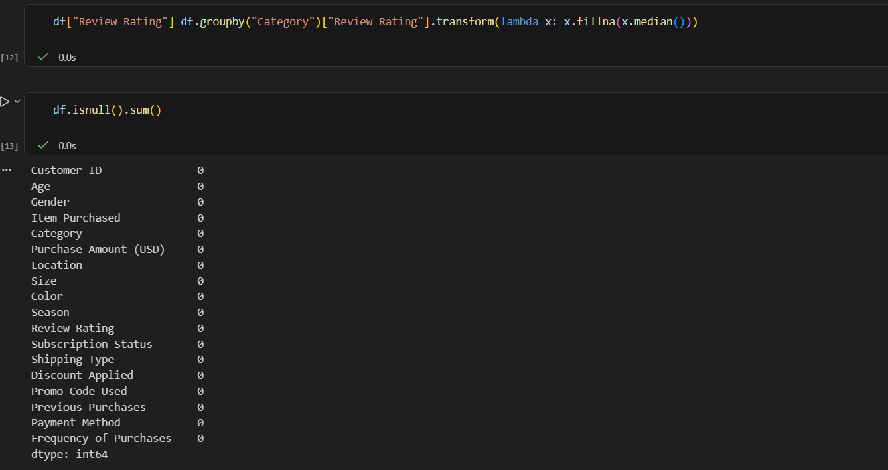

---

### 3. Column Standardization

Standardized column names for SQL compatibility.

Examples:

- Purchase Amount (USD) → purchase_amount
- Review Rating → review_rating

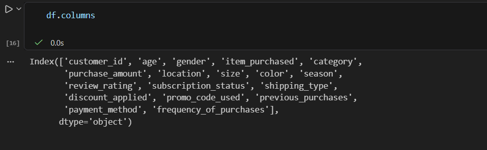

---

### 4. Feature Engineering

Created additional business-friendly features.

Examples:

- age_group
- purchase_frequency_days

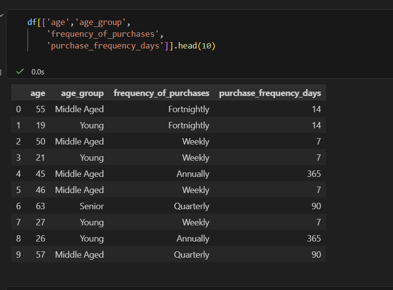

---

### 5. Database Creation

Created a MySQL database and loaded the cleaned dataset using SQLAlchemy.

Database:
```sql
retail_customer_behavior
```

Table:
```sql
customer
```

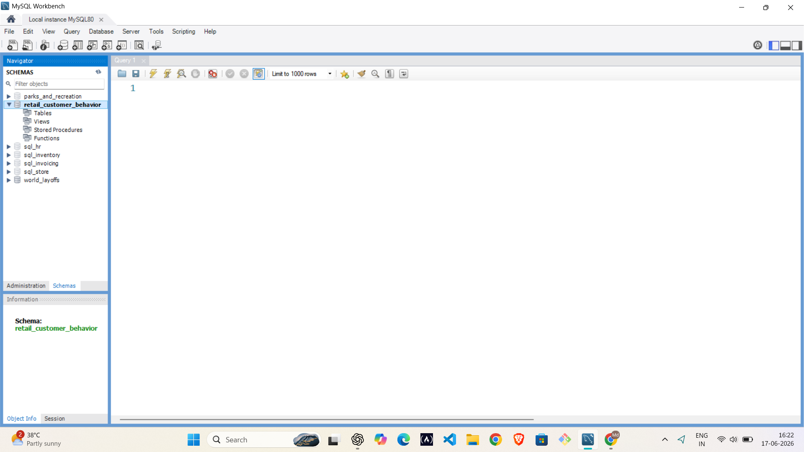

---

### 6. Data Loading into MySQL

Successfully connected Python and MySQL and loaded the transformed dataset.

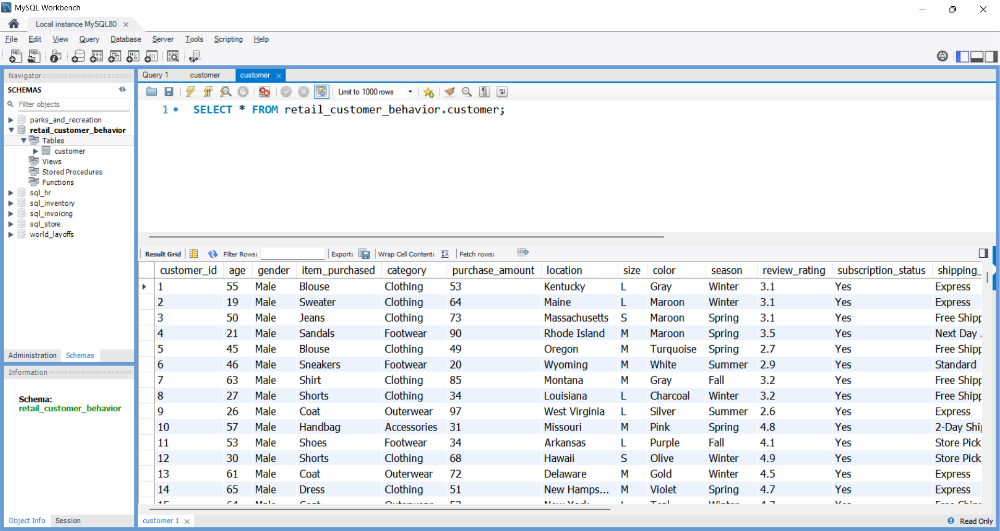

---

## SQL Business Analysis

The following business questions were answered using SQL:

### Q1. What is the total revenue generated by male vs. female customers?

### Q2. Which customers used a discount but still spent more than the average purchase amount?

### Q3. Which are the top 5 products with the highest average review rating?

### Q4. Compare average purchase amounts between Standard and Express shipping.

### Q5. Do subscribed customers spend more?

### Q6. Which products have the highest percentage of discounted purchases?

### Q7. Segment customers into New, Returning, and Loyal groups.

### Q8. What are the top purchased products within each category?

### Q9. Are repeat buyers more likely to subscribe?

### Q10. What is the revenue contribution of each age group?

---

## Power BI Dashboard

An interactive dashboard was developed to visualize customer behavior and business performance.

### Dashboard Overview

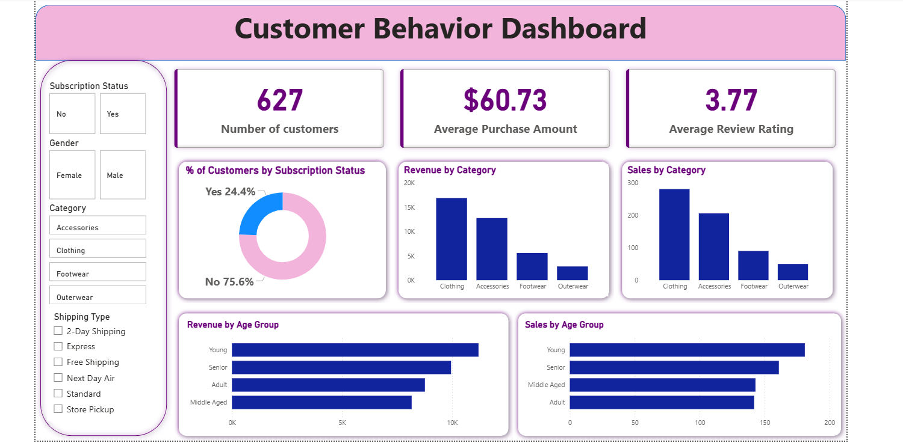

### Subscription Filter

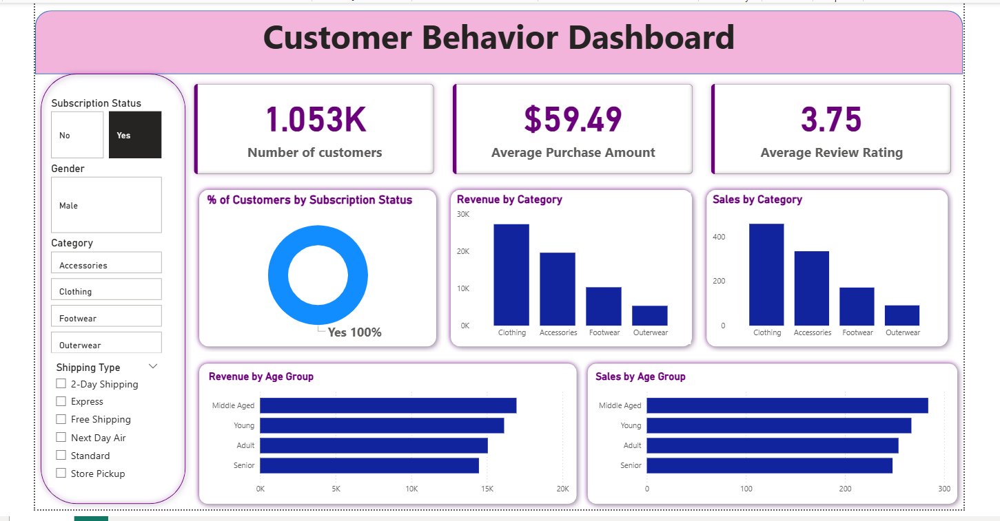

### Gender Filter

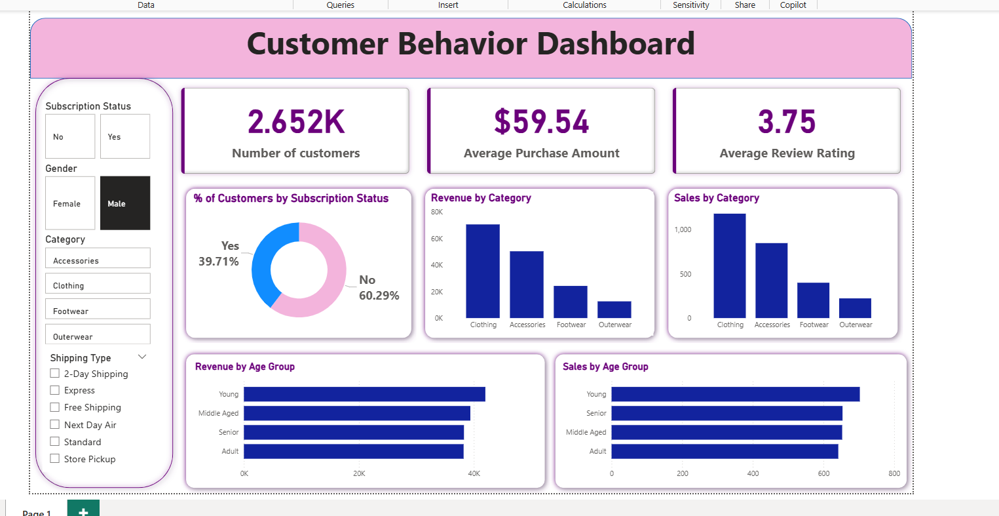

### Category Filter

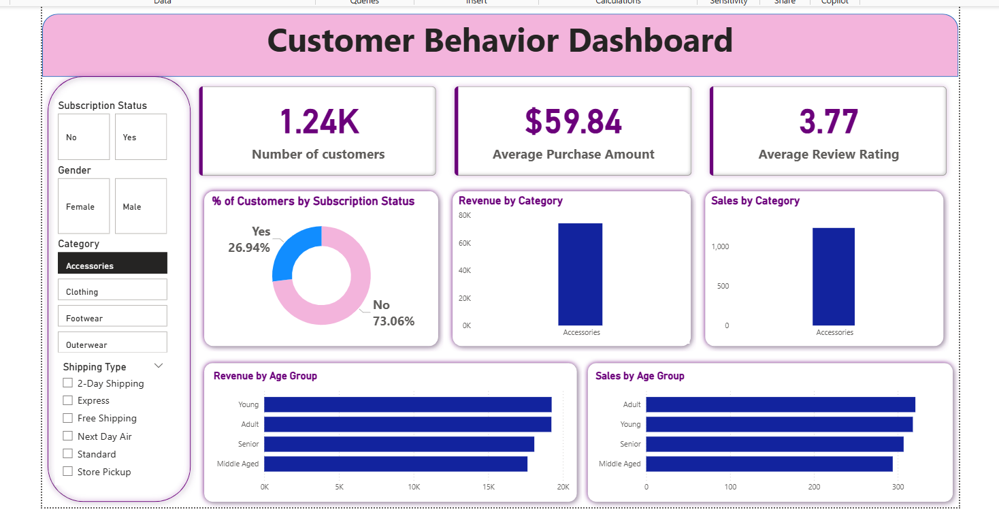

---

## Key Insights

### Customer Base

- Total Customers: ~3,900
- Average Purchase Amount: ~$60
- Average Review Rating: ~3.75

### Product Categories

- Clothing generated the highest revenue.
- Accessories ranked second in sales volume.
- Outerwear contributed the lowest revenue.

### Customer Behavior

- Non-subscribers represent the majority of customers.
- Younger customers contributed the highest revenue.
- Repeat buyers showed stronger engagement and subscription tendencies.

---

## Repository Structure

```text
Retail-Customer-Behavior-Analysis
│
├── data
│   ├── raw
│   └── processed
│
├── notebooks
│   └── 01_data_inspection.ipynb
│
├── sql
│   └── business_analysis_queries.sql
│
├── dashboard
│   └── retail_customer_behavior_dashboard.pbix
│
├── screenshots
│
├── README.md
│
└── requirements.txt
```

---

## Future Improvements

- Customer segmentation using clustering
- Predictive purchase behavior modeling
- Churn prediction
- Automated reporting pipeline
- Cloud database deployment

---

## Author

**Mohammed Abdul Wasey**

Data Analyst | Python | SQL | Power BI | Machine Learning
